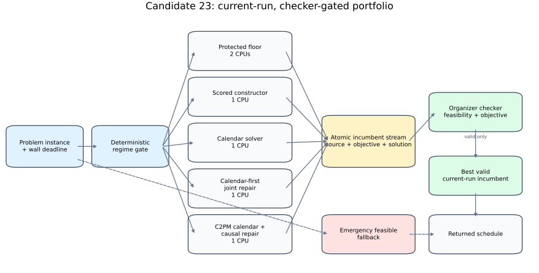
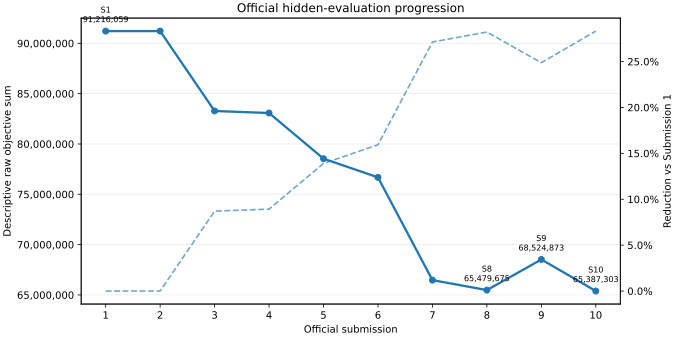
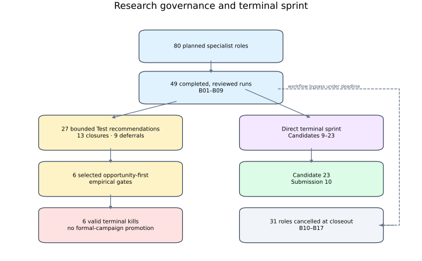

# Don't Block Your Own Exit

**Engineering a Reliable Anytime Solver for the OGC 2026 Grand Shipyard Challenge**

The OGC 2026 Grand Shipyard challenge combines irregular multilayer packing,
temporal scheduling, bay assignment, weighted tardiness, workload balance, bay
preferences, and directional crane precedence under an approximately 60-second,
four-core execution limit. I developed a **final solver** that treats those
constraints as one coupled space-time realization problem rather than scheduling
first and repairing geometry afterward.

The system selects one of two validated four-core topologies, runs complementary
current-instance search workers, publishes only complete candidates through an
atomic incumbent protocol, and returns only a solution accepted by the organizer
checker. Across ten chronological organizer evaluations on the same six hidden
evaluation cells, all **60/60 outputs were feasible**. The row-level history and
its descriptive, non-score aggregates are presented below rather than treated as
headline performance metrics.

**[Read the 13-page technical retrospective](report/technical-retrospective.pdf)**



## Why the problem is coupled

A temporally attractive calendar may be impossible to place. A collision-free
layout may fail once residence intervals overlap. A schedule and layout that are
individually valid may still violate crane reachability or same-day precedence.
The final architecture therefore coordinates:

- temporal assignment and ENTRY/EXIT residence;
- bay, orientation, and anchor selection;
- crane-aware operation order;
- objective-aware construction and joint repair;
- deadline reserves, fallback, checking, and process cleanup.

## Technical contributions

- **Regime-gated multicore portfolio:** a lower-pressure topology protects a
  two-core feasible path, while a high-pressure topology allocates one CPU to each
  of four complementary current-run workers.
- **Checker-gated incumbent protocol:** atomic publication, strict-improvement
  replacement, corrupt-record rejection, and parent-level organizer-checker
  validation.
- **Joint space-time repair:** coherent block neighborhoods, concrete residency
  alternatives, bounded exact selection, and a protected best-valid return state.
- **Native geometry kernel:** C++17/pybind11 bit-packed anchor-feasibility mapping
  with Python fallback and randomized NumPy-equivalence tests.
- **Evidence-governed iteration:** frozen identities, paired controls, persisted
  replay, opportunity-first mechanism gates, explicit rollback, and retained
  negative results.

## Official evaluation history

The evaluation sequence below uses chronological labels created by this
retrospective; they are not organizer-assigned submission identifiers.

| Record | Value |
|---|---|
| Evaluated solver versions | 10 |
| Hidden outputs | 60 |
| Feasible outputs | **60/60** |
| First descriptive raw sum | 91,216,059 |
| Final descriptive raw sum | 65,387,303 |
| Descriptive reduction | **28.316%** |
| Exact final rank | Not preserved in the available official records |

The corrected row-level history is in
[`results/official-evaluation-history.csv`](results/official-evaluation-history.csv).
Public v1.1 rebuilds all ten rows from the direct organizer result emails retained
in the private evidence archive. Public v1.0 contained an unsupported intermediate
history; its final vector and first-to-final summary were correct, but v1.1 is the
current authority.



## Research and validation

A structured research program recorded 49 separately reviewed investigations:
27 bounded-test recommendations, 13 closures, and 9 deferrals. In the formal
workflow, one investigation bound one question to a specialist response,
provenance, and a separate review record. Six selected opportunity-first gates
reached terminal kills because their required event or action coverage was absent
or below the frozen threshold.



See
[`methodology/research-and-validation-process.md`](methodology/research-and-validation-process.md)
for the workflow and its terminal-sprint latency boundary.

## Source and reproducibility

```text
solver/final-release/   final submitted Python source
solver/native-kernel/   C++17/pybind11 geometry-kernel source
results/                corrected official evaluation history
figures/                deterministic report figures
reproducibility/         source manifest and release boundary
report/                  Markdown source, references, and PDF
```

The seven Python files under `solver/final-release/` are byte-identical to the
frozen final package. The submitted binary and exact ZIP remain private; their
SHA-256 identities are recorded in
[`reproducibility/source-manifest.json`](reproducibility/source-manifest.json).
Organizer problem data and checker code are intentionally excluded.

```bash
python -m venv .venv
source .venv/bin/activate
pip install -r requirements-dev.txt
python solver/native-kernel/setup.py build_ext --inplace
pytest -q
```

## Contribution boundary

Kevin Yin owned the decomposition, architectural direction, research questions,
experiment and promotion gates, evidence interpretation, package-selection and
submission decisions, stop decision, and final claim boundary.

**AI-assisted** systems were used throughout literature synthesis, implementation,
testing, experiment execution, adversarial review, evidence processing, and
documentation. The project did not preserve a defensible source-level percentage
for AI-written versus human-written code. Model agreement was never treated as
empirical validation; frozen artifacts, checker results, measured runs, and Kevin
Yin's promotion and submission decisions remained the governing evidence.

## Exact provenance

The private development identifier of the final solver is `Candidate 23`, frozen at
commit `731b3ca9a59c898f4b097e95b75f43336ccb55ee`. That internal identifier is kept
for traceability rather than used as the public name of the system.
