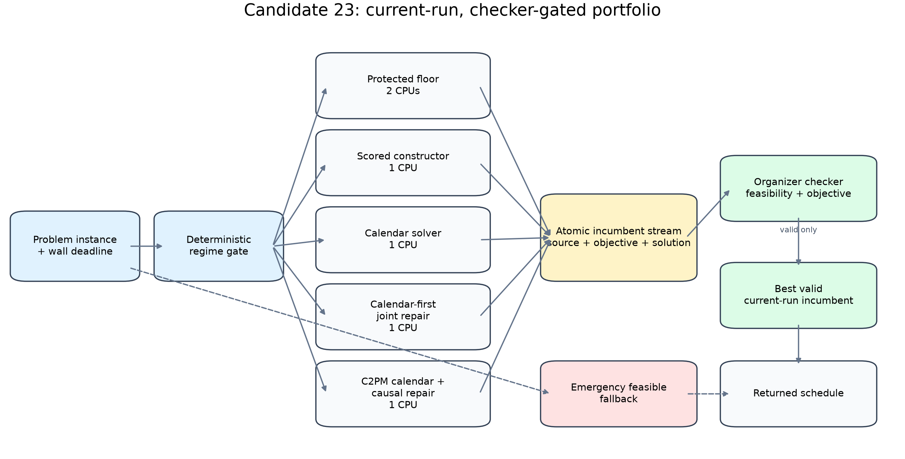
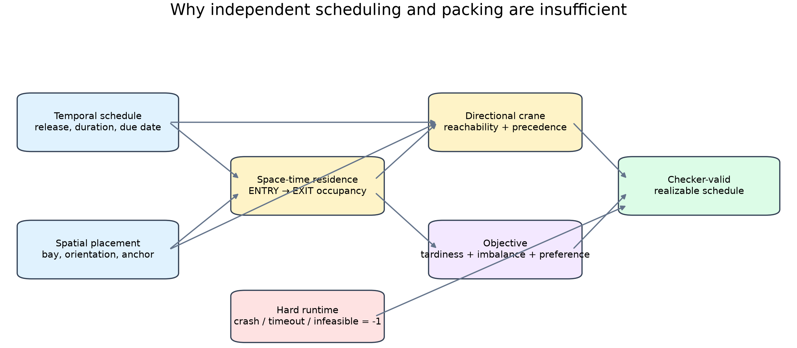
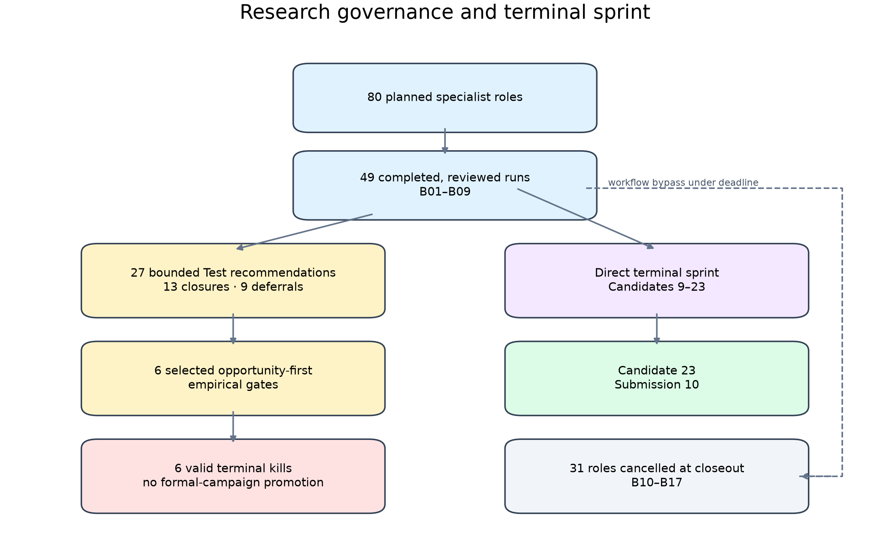
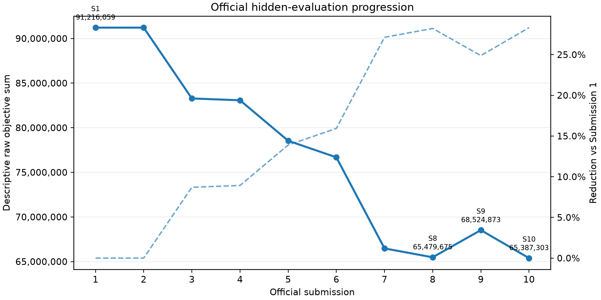

# Project at a glance

| Item | Record |
|---|---|
| Competition | Optimization Grand Challenge 2026, Grand Shipyard |
| Participant | Kevin Yin, Team Smoop |
| Final solver | Candidate 23, submitted as Submission 10 |
| Compute envelope | CPU-only, four cores, 16 GB memory, approximately 60 seconds per instance |
| Official campaign record | Ten submissions, 60/60 hidden outputs feasible |
| Final official vector | 11,280; 31,368; 103,065; 6,464,170; 16,443,998; 42,333,422 |
| Descriptive progression | Raw six-instance sum reduced 28.316% from first to final submission |
| Public release | Final Python source and native-kernel source; no organizer data, checker, exact ZIP, or submitted binary |

The challenge was announced as a worldwide optimization competition and framed
around a shipyard planning problem with operational constraints and a restricted
evaluation environment [@lgcns2026ogc]. The official problem specification made
feasibility a first-order requirement: an infeasible output, process failure, or
timeout received a score of `-1` [@ogc2026problem2026]. That penalty changed the
engineering objective. A solver that occasionally found a superior schedule but
sometimes failed was not a viable competitor. The relevant product was an
**anytime feasible system** whose search quality improved without weakening its
ability to return a validated schedule before the deadline.

The final public artifact is deliberately narrower than the private campaign
archive. It contains the technical retrospective, official result transcription,
selected methodology, final source, native geometry source, and reproducibility
boundaries. It does not publish the organizer's intellectual property or private
participant records.

{#fig:architecture width=100%}

# 1. Problem structure

## 1.1 Decision surface

Each block had to be assigned a bay, orientation, integer anchor, entry day, and
exit day. The schedule determined when the block occupied shipyard space. The
placement determined which cells and layers it occupied. Operations on the same
day had to respect ordering and crane-access rules. The objective combined three
terms:

1. weighted tardiness;
2. workload imbalance across bays;
3. loss relative to bay preferences.

This produced a coupled space-time optimization problem. A temporally attractive
assignment could be geometrically unrealizable. A collision-free static layout
could become invalid when residence intervals overlapped. A schedule and layout
that were individually valid could still violate directional crane reachability
or same-day precedence.

Irregular packing research commonly uses no-fit representations, rasterized
occupancy, discrete anchor models, coordinate descent, and hybrid exact-heuristic
methods [@toledo2013dottedboard; @mundim2017nfr; @mundim2018limitedcontainers;
@umetani2022coordinatedescent; @gomes2006hybrid]. The Grand Shipyard problem added
a temporal and operational layer. Work on spatial shipbuilding schedules and
block relocation reinforces why placement cannot be optimized independently of
future access and operational sequence [@ge2021irregularblocks; @kim2006enar].

{#fig:coupling width=100%}

## 1.2 Why decomposition repeatedly failed

A tempting architecture is:

```text
schedule first -> place blocks -> repair collisions -> return
```

That pipeline was useful as a constructor, but insufficient as a complete search
model. The decoder had to answer a joint question:

> Can this bay, date, orientation, anchor, residence interval, and operation order
> coexist with the frozen outside state and remain crane-realizable?

When the answer was no, changing only one dimension often preserved the actual
cause of failure. Delaying a block could create a new tardiness loss without
opening a valid spatial route. Moving a block could create a future crane blocker.
Changing a bay could improve preference but worsen the global load-range term.
The later solver therefore treated a placement as a **space-time column** rather
than an isolated coordinate.

## 1.3 Hard-deadline consequences

The evaluation envelope imposed three system requirements beyond optimization
quality:

- A useful incumbent had to exist early.
- Experimental work had to be interruptible without corrupting the incumbent.
- Process startup, native libraries, child cleanup, serialization, and final
  checking all consumed the same wall budget as search.

This is the same broad phenomenon that motivates restart and portfolio methods
for stochastic search: runtime distributions can be erratic, and a collection of
bounded searches can dominate one uninterrupted trajectory [@luby1993optimal;
@gomes2000heavytailed; @aiex2007tttplots; @fischetti2014erraticism;
@weise2019betandrun]. In this challenge, however, every portfolio member also had
to preserve an exact, current-instance validation path.

# 2. Final solver architecture

Candidate 23 was a deterministic, current-run portfolio. It did not select from
stored historical solutions. Every worker solved the current input, published
only complete candidates, and competed through a small atomic incumbent protocol.
The parent process returned only a candidate that passed the organizer checker.

## 2.1 Regime gate

The parent derived cheap structural features from the input, including block count
and a pressure proxy. It used those features only to choose between two previously
validated process topologies.

**Lower-pressure topology**

- protected floor worker using two CPUs;
- calendar worker using one CPU;
- calendar-seeded joint-repair worker using one CPU.

**High-pressure topology**

- scored constructor using one CPU;
- calendar worker using one CPU;
- calendar-first repair worker using one CPU;
- C2PM calendar-and-geometry worker using one CPU.

The gate did not predict a winner among arbitrary algorithms. It selected between
two fixed deployment configurations. That distinction limited feature leakage and
made fallback behavior auditable.

## 2.2 Protected floor and early feasibility

The floor solver descended from the strongest previously organizer-tested
submission. Its primary job was to preserve a validated solution path while later
workers attempted more structural changes. In the lower-pressure regime, it owned
two CPUs because its anytime depth remained valuable and because replacing its
compute with a weak fourth lane had regressed measured outcomes.

The floor used constructive placement, cached forbidden maps, bounded local
search, and defensive deadline handling. It maintained a module-level incumbent
that could survive exceptions and late alarms. The final parent still rechecked
its output; the floor's internal validation was not accepted on trust.

## 2.3 Scored constructor

The high-pressure constructor emphasized objective-bearing feasibility rather than
merely placing the easiest next block. Its ordering and candidate scoring used
release dates, duration, due dates, bay preferences, workload effects, and spatial
availability. It streamed improving incumbents during execution instead of
publishing only its terminal state.

Streaming mattered because process termination near the deadline was expected.
A worker could be killed after publishing a useful intermediate result without
losing all of its work.

## 2.4 Calendar solver

The calendar lane generated a temporal assignment before full geometric
realization. It was valuable because it could expose lower-tardiness structure
that a placement-first greedy policy never visited. The calendar itself was not
accepted as a solution. It published a complete realized candidate when possible
and also exposed a bounded calendar channel for a repair consumer.

The implementation treated that channel separately from the global incumbent.
A calendar could be worse than the current best complete solution yet still
contain a useful structural seed for joint repair.

## 2.5 Calendar-first joint repair

The repair lane replayed a current complete solution into a mutable model, removed
a coherent set of blocks, enumerated alternative space-time columns against the
frozen outside background, and solved a small exact selection problem. It retained
only a strict checker-valid improvement.

The neighborhood was causal rather than purely geometric. Candidate blocks could
be selected because they contributed to tardiness, preference loss, spatial
obstruction, or a calendar-realization failure. The exact subproblem did not claim
to solve the global challenge. It coordinated a bounded set of alternatives that
sequential regret repair could miss.

## 2.6 C2PM plus causal repair

The fourth high-pressure worker began from a coupled calendar/placement seed and
then applied joint repair. Its purpose was to cross barriers that required several
coordinated changes. The working state could traverse neutral or temporarily
worse checker-valid arrangements while an immutable best-known return state was
preserved.

That separation between **working state** and **returned best** was essential.
Ordinary strict descent protects quality but can make the search graph
disconnected. Allowing controlled non-record transitions can reach another basin,
but only if the returned incumbent is independently protected.

## 2.7 Atomic incumbent protocol

Workers published records of the form:

```text
schema version
source role
generation
objective
complete solution
metadata
```

Writes used same-directory temporary files, `fsync`, and atomic replacement.
A stable companion lock serialized publishers. A record replaced the incumbent
only when its objective was strictly lower, except for a narrow equal-objective
case that replaced a partial record with a final validated record.

The protocol rejected nonfinite objectives, corrupt JSON, and incomplete solution
records. It supported recovery after a partial file and preserved a generation
history during private testing.

## 2.8 Organizer-checker selection

The parent did not infer feasibility from worker provenance. It loaded each
candidate and called the organizer-provided checker. A candidate without an exact
objective or with any feasibility failure was discarded. The parent selected the
lowest objective among current-run valid candidates.

This produced a clean trust boundary:

```text
worker proposal -> durable record -> organizer checker -> parent selection
```

The emergency path generated or recovered a feasible fallback when ordinary
workers failed to publish in time. Deadline reserves protected final parsing,
checking, selection, and process cleanup.

## 2.9 Native geometry kernel

The hottest primitive constructed a feasible anchor map from multilayer block
masks and forbidden occupancy. The submitted solver used a CPython 3.12 Linux
extension. The public source release includes a C++17/pybind11 implementation that
packs each column into a 32-bit bitset, shifts masks over candidate anchors, and
returns a Boolean feasible map.

The native path accelerated a representation already used by the Python solver;
it did not change challenge semantics. Python fallback remained available when
the extension could not load. The public tests build the source and compare it
against a direct NumPy reference on randomized multilayer cases.

# 3. Development trajectory

The private campaign contained many candidate identities. The useful story is not
the number of variants; it is how the system model changed.

## 3.1 Era I: feasibility before optimization

The first objective was to produce complete schedules consistently. Early work
built:

- deterministic constructive ordering;
- exact checker integration;
- module-level incumbent protection;
- wall-clock alarms and deadline reserves;
- clean fallback behavior;
- reproducible release packaging.

The first two official submissions tied exactly. That was still useful: it showed
that packaging and evaluation could be repeated without accidental drift. Later
changes were evaluated against a stable operational baseline.

## 3.2 Era II: geometry as the hot path

The next bottleneck was repeated containment and collision work. The system moved
toward cached forbidden maps, compact occupancy operations, and a compiled anchor
primitive. The goal was not only lower primitive latency. Saved time had to produce
more completed constructive or repair decisions before the same deadline.

This distinction eliminated several misleading optimizations. A faster primitive
that did not change completed search work, or changed it in a way that degraded
the incumbent, was not promoted.

## 3.3 Era III: portfolios and structural repair

The solver then added concurrent roles and deeper neighborhoods. The critical
questions became:

- Which lane creates value that the protected floor does not already find?
- Does communication change an actual consumer decision?
- Does a fourth worker add marginal value after CPU contention?
- Can a calendar seed be realized without freezing a bad geometry?

Several worker-sharing proposals died because the required event never occurred.
This was a useful result: a theoretically plausible communication mechanism has
zero value when its producer never publishes, its consumer never reads, or its
message never changes an action.

## 3.4 Era IV: barrier crossing and Candidate 23

Candidate 11 introduced causal joint repair over date, bay, orientation, anchor,
and operation order. Candidate 14 added a best-preserving barrier-crossing working
state and showed local records after non-record transitions. Its official hidden
evaluation then regressed on three of six instances. That failure prevented a
public-success narrative from replacing hidden evidence.

Candidate 23 preserved the strongest protected components, added a four-way
high-pressure portfolio, and replaced one global repair lane with C2PM plus causal
repair. Its local release gate improved selected difficult public instances while
retaining exact validation and process cleanup. Submission 10 then produced the
best descriptive raw six-instance sum in the ten-submission campaign.

# 4. Experimental method

## 4.1 Identity before comparison

Every release candidate was bound to source hashes, package members, and a release
commit. Deterministic ZIP construction fixed member order, timestamps, modes, and
compression. A build refused missing members, extra files, or source-hash drift.

This prevented a common failure mode in heuristic work: comparing a result to a
candidate name when the actual bytes had changed.

## 4.2 Current-run versus historical evidence

A stored output could establish that a mechanism had once produced a result. It
could not establish current runtime reliability, current package identity, or
current process interaction. Promotion gates therefore distinguished:

- historical best output;
- in-process current output;
- persisted current output;
- exact packaged output.

The final parent selected only current-run candidates.

## 4.3 Paired and order-balanced controls

Stochastic fixed-wall search varied even with a stable source. Where attribution
mattered, experiments used paired controls, reversed order, repeated same-binary
runs, or explicit noise envelopes. The purpose was not to eliminate all runtime
variance. It was to avoid attributing an ordinary trajectory fluctuation to a
code change.

## 4.4 Opportunity-first gates

Before building a costly treatment, the campaign often tested whether its required
event existed. Examples included:

- specialist eligibility events;
- exact reusable cycle conflicts;
- publish/read/import events between workers;
- remote-specific destroy redirects;
- complete counterfactual action coverage;
- second-candidate transactional states.

Six selected formal gates reached valid terminal kills. Each negative result
closed a precisely frozen lane rather than inviting a new panel or threshold.

{#fig:research width=92%}

## 4.5 Independent review and scope control

The formal ResearchLab campaign separated research runs, independent reviews,
shared ledgers, and implementation authority. It planned 80 roles and completed 49
reviewed runs through B09. The accepted reports returned 27 bounded Test
recommendations, 13 closures, and 9 deferrals.

The campaign did not complete its original 80-role acceptance condition. It was
closed as cancelled at 49/80 roles when the competition ended. The remaining 31
roles were not represented as completed. Candidates 9 through 23 were developed
through a direct terminal sprint. The retrospective conclusion is that the formal
workflow was strong at pruning and provenance but too coordination-heavy for the
last competition window.

# 5. Official evaluation

## 5.1 Ten-submission record

| Sub. | P1 | P2 | P3 | P4 | P5 | P6 | Descriptive raw sum |
|---:|---:|---:|---:|---:|---:|---:|---:|
| 1 | 11,280 | 31,368 | 130,705 | 10,153,470 | 28,945,493 | 51,943,743 | 91,216,059 |
| 2 | 11,280 | 31,368 | 130,705 | 10,153,470 | 28,945,493 | 51,943,743 | 91,216,059 |
| 3 | 11,280 | 31,368 | 106,650 | 8,691,553 | 24,764,083 | 49,673,443 | 83,278,377 |
| 4 | 11,280 | 31,368 | 107,570 | 8,231,627 | 24,608,769 | 50,085,398 | 83,076,012 |
| 5 | 11,280 | 31,368 | 105,855 | 7,369,833 | 23,166,627 | 47,853,733 | 78,538,696 |
| 6 | 11,280 | 31,368 | 105,855 | 7,215,499 | 22,243,379 | 47,073,282 | 76,680,663 |
| 7 | 11,280 | 31,368 | 103,065 | 7,136,168 | 17,492,599 | 41,698,677 | 66,473,157 |
| 8 | 11,280 | 31,368 | 103,065 | 6,187,873 | 17,447,412 | 41,698,677 | 65,479,675 |
| 9 | 11,280 | 31,368 | 103,065 | 7,160,951 | 17,449,131 | 43,769,078 | 68,524,873 |
| 10 | 11,280 | 31,368 | 103,065 | 6,464,170 | 16,443,998 | 42,333,422 | 65,387,303 |

All ten official evaluations returned six feasible outputs. The campaign therefore
finished with **60/60** feasible hidden outputs and no observed crash, timeout, or
infeasibility penalty.

The first-to-final descriptive raw sum decreased by **28.316%**. That aggregate is
**not the competition score**. The competition ranked teams per instance, so the
location of a gain or regression mattered independently of its contribution to a
simple six-instance sum.

{#fig:results width=100%}

## 5.2 What the progression shows

Three features are more informative than a monotone-success story.

First, Submission 4 reduced P4 and P5 but regressed P3 and P6 enough that the
aggregate barely changed. A feature can help one structural regime while harming
another.

Second, Submission 9 was locally promoted after Candidate 14 produced strong
public results. The hidden evaluation regressed P4, P5, and P6 relative to
Submission 8. Public breadth was not a reliable substitute for hidden transfer.

Third, Submission 10 did not dominate Submission 8 instance by instance. It
improved P5 substantially, worsened P4 and P6, and tied P1-P3. Its descriptive raw
sum was lower, but the competitive effect depended on the field's hidden values.

The **exact final preliminary-round rank was not preserved** in the available
official records. This report therefore makes no rank, award, or optimality claim.

# 6. Negative results that changed the system

## 6.1 Timing-only optimization did not ensure realization

A low-tardiness calendar was not equivalent to a realizable solution. The decoder
could lose its temporal gain when it encountered occupancy or crane conflicts.
This motivated joint space-time columns and repair rather than deeper optimization
of an unrealizable calendar alone.

## 6.2 In-memory success was not durable evidence

One earliest-entry investigation produced promising in-process behavior but could
not reproduce the required state from persisted artifacts. It was invalidated,
not promoted. This changed the evidence rule: a mechanism had to survive exact
serialization, reload, replay, and checker validation.

## 6.3 Several plausible mechanisms had zero opportunity

Formal gates found zero useful events for exact cycle reuse, cross-worker restart
import, remote-specific destroy guidance, and two-candidate transactional capture.
The correct conclusion was not that the broader research fields were invalid. It
was that the accepted solver did not expose enough of the required event for those
specific mechanisms to matter.

## 6.4 More workers could reduce value

A fourth lane sometimes consumed CPU that the floor used more effectively.
Post-hoc improvement of a frozen floor state did not imply a win against the
still-running floor under equal wall time. The final architecture retained a
four-way portfolio only in the high-pressure regime where the alternative roles
had measured complementary value.

## 6.5 Public improvement did not guarantee hidden transfer

Candidate 14 was the clearest calibration event. Its local gate was strong enough
to justify submission, but the hidden vector regressed relative to the protected
Submission 8 floor. The consequence was not to dismiss local testing. It was to
reduce confidence in public-cell breadth as a rank forecast and to preserve a more
explicit transfer boundary in the final report.

# 7. Contributions and AI-assisted development

## 7.1 Kevin Yin's role

Kevin Yin retained responsibility for:

- decomposing the challenge into geometry, scheduling, crane, reliability, and
  search surfaces;
- selecting solver architecture and candidate lineages;
- defining research questions, experiment gates, promotion criteria, and rollback
  rules;
- interpreting local and official evidence;
- deciding which package to submit;
- deciding when to stop the campaign;
- producing and approving the final public narrative.

## 7.2 AI assistance

**AI systems materially assisted** literature synthesis, source inspection,
implementation, test construction, experiment execution support, adversarial
review, evidence normalization, and documentation. Multiple agents or models were
used for independent perspectives, but model agreement was never treated as
empirical validation. The accepted checker, frozen artifacts, measured runs, and
human promotion decisions remained the governing evidence.

The competition explicitly allowed AI-assisted development while assigning
quality and correctness responsibility to participants. This report treats that
assistance as part of the engineering process rather than hiding it or presenting
it as an autonomous authorship claim.

## 7.3 Organizer-provided authority

The challenge formulation, instances, official checker, evaluation environment,
and hidden evaluations belonged to the organizer. This public repository does not
redistribute those materials. Source files import the organizer's `utils` module
when used inside the challenge environment.

# 8. Reproducibility boundary

The public source release contains the seven Python files included in the final
submission, byte-identical to their frozen private versions. It also contains the
C++/pybind11 geometry-kernel source and a randomized equivalence test.

The following are intentionally absent:

- organizer problem and evaluation data;
- organizer checker;
- exact submission ZIP;
- compiled Linux CPython 3.12 extension;
- private emails, certificate, screenshots, and raw experiment corpora.

The exact private ZIP and binary are identified by SHA-256 in the source manifest.
A byte-for-byte reproduction of the submitted native extension is not claimed,
because the full original container identity was not preserved. The source can be
rebuilt and behaviorally tested, but that is a narrower claim.

# 9. Generalizable lessons

1. **Feasibility is an architectural invariant.** It cannot be added as a final
   validation step to a search that routinely destroys the only return path.
2. **The useful unit is the coupled decision.** Optimizing schedule, geometry, or
   worker communication in isolation often changes no valid endpoint.
3. **Opportunity precedes efficacy.** Before building a sophisticated selector,
   prove that multiple meaningful actions occur often enough to justify it.
4. **Current-run evidence outranks stale excellence.** A historical output is not
   a current package, runtime, or cleanup guarantee.
5. **Negative experiments are capital.** A valid kill narrows the system and
   protects the final sprint from repeatedly attractive ideas.
6. **Reliability consumes budget.** Process startup, serialization, checking,
   cleanup, and fallback reserves are part of the optimization algorithm.
7. **Public validation has a transfer ceiling.** Broad local wins can justify a
   submission, but they do not establish hidden superiority.
8. **Research governance has latency.** Heavy review can improve decisions while
   becoming unsuitable for a deadline-critical terminal phase; the workflow needs
   a lower-latency mode rather than blind continuation.

# Conclusion

The Grand Shipyard campaign evolved from a feasible constructor into a
checker-gated, current-run, multicore anytime system. The central technical shift
was recognizing that scheduling, placement, residence, crane access, and
objective value formed one realization problem. The central engineering shift was
protecting a feasible incumbent while allowing specialized workers to search more
aggressively.

Candidate 23 closed the project with six feasible official outputs, a 60/60
campaign feasibility record, and the lowest descriptive raw six-instance sum of
the ten submissions. The project does not support a stronger statement about
rank, optimality, or universal transfer. Its durable contribution is the solver
architecture, the evidence discipline around it, and the negative results that
made the final system smaller and more reliable.

# Artifact identities

| Artifact | Identity |
|---|---|
| Candidate 23 private release commit | `731b3ca9a59c898f4b097e95b75f43336ccb55ee` |
| Candidate 23 private release tag | `candidate23-release-20260727` |
| Private submission ZIP SHA-256 | `0b3442ebc2513cd0bedece780f33331f719293513667f075bb3cface08c4cf4e` |
| Submitted native extension SHA-256 | `a1f0309bc7d30a6482528bf9a6b52107e02e622365a33c1517d65fbaa1636737` |
| Puzzle closeout commit | `c38042b48e6d7cc2ad53cd56a4f5aa7d3e6c6059` |
| Puzzle closeout tag | `ogc2026-closeout-v1.0` |
| Public release | `v1.0.0` |

# References
